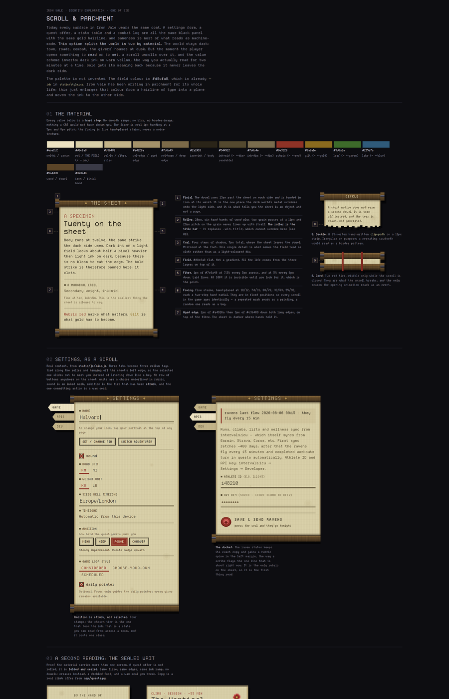
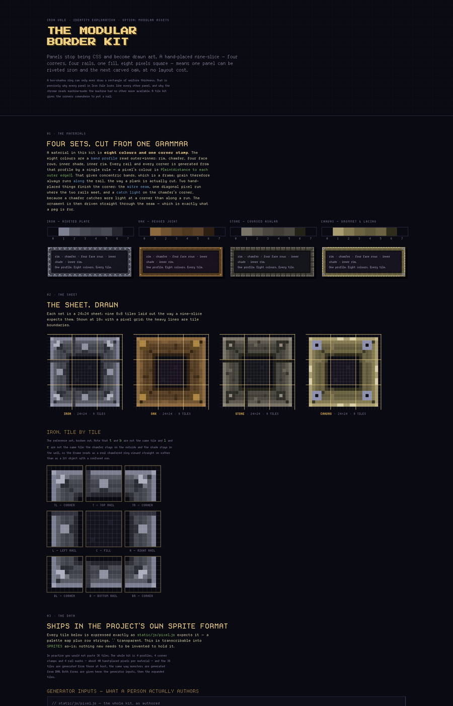
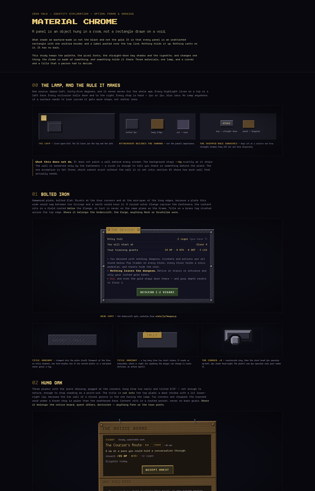
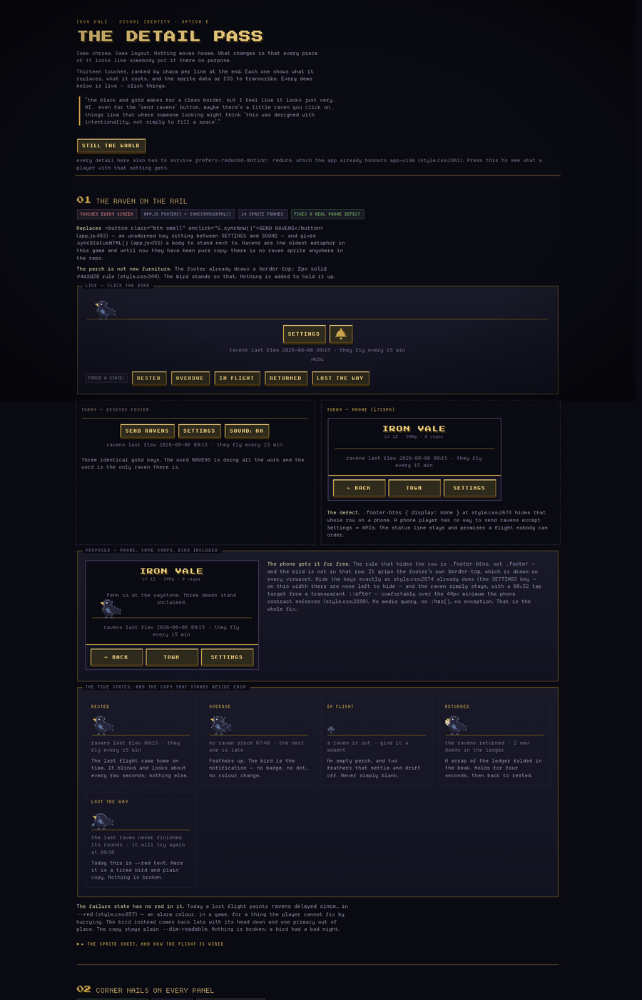
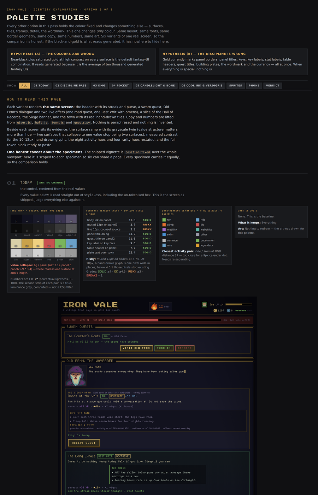
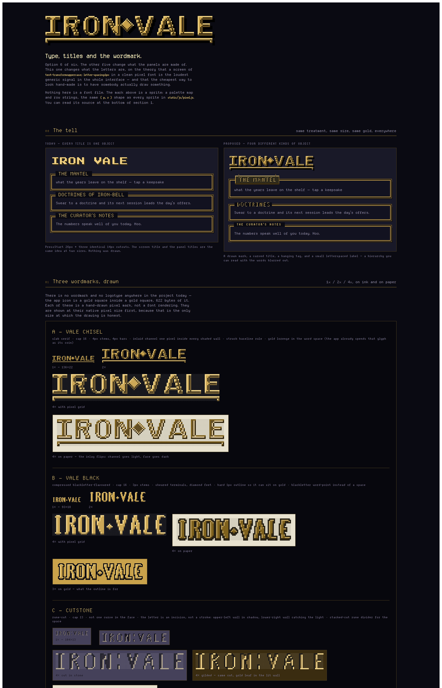

# Visual identity — six options

Nothing here is built. Nothing here changes a line of the app. Six options were
explored in parallel, each one a self-contained HTML page under
`docs/mockups/identity/` that renders real copy, real numbers and real sprites
pulled out of the app, wearing a different answer to the same complaint: the
current black-and-gold chrome looks generated.

Each page carries its own annotation wall — what it changes, what it keeps, what
it costs, in the author's own words. This document is the index, plus the one
thing worth knowing before you open any of them.

**The finding the six options arrived at independently: the problem is mostly
discipline, not colour.** Gold currently paints the wordmark, the panel border,
the panel outer ring, the panel title, every quest title, every key face, every
key label, every stat label, every table header, every building plate, the XP bar
fill, the coin count and two kinds of chip. Fourteen jobs, one colour. An eye
cannot rank fourteen equally bright things, so it stops trying — and a screen
where nothing is emphasised looks like a screen where nobody decided anything.
The palette study proves this by controlled experiment: its variant 02 changes
not one hue, only which element gets the gold, and the screen stops looking
automatic. The corollary is that a real chunk of the fix costs no art at all.

---

## Scroll & Parchment

Today every surface wears the same coat: a settings form, a quest offer, a stats
table and a combat log are all the same black panel with the same gold hairline,
and sameness is most of what reads as machine-made. This option splits the world
in two by material. The dark stays dark — town, roads, combat, the givers'
houses at dusk — but the moment you open something to read or to set, a scroll
unrolls and the value scheme inverts: dark ink on warm vellum, the way you
actually read for two minutes at a time. Gold gets its meaning back because it
never leaves the dark side.

The field colour is not invented. It is `#d8cfa8`, which is already `--ink` in
`style.css`. Iron Vale has been writing in parchment its whole life; this
enlarges that colour from a hairline of type into a plane.

**Keeps** the whole palette (red becomes the rubric, `--dim` and
`--dim-readable` get direct twins), hard pixel steps with no radius or blur, the
real strikes at their native sizes, the shipped `ks_seal` and `icon_coin`
sprites unedited, and the vignette — which on parchment reads as candlelight
rather than CRT falloff.

**Costs**, and they are real. Gold dies on this field: `--gold` on vellum is
about 1.5:1, so every gold accent on a sheet has to become a darker gilt, and
gold stops meaning "important" and starts meaning "the dark world". `.win-title`
cannot survive at all — it works by punching a hole in the panel border and
filling it with `--bg`, and there is no dark to notch into on a scroll. `.btn`
becomes a second full button system rather than a variant, which is the biggest
bill. Semantic colour narrows: green and blue both need darker twins, and the
coloured-face button variants have no parchment equivalent, so the colour has to
move into the ink.

**Headline finding.** This is not a reskin, it is a second half of the design
system. It costs roughly a button system, a token layer and one hard rule about
gold. What it buys is that a settings sheet and a combat log stop looking like
the same object, and that the thing you stare at for two minutes is finally the
highest-contrast thing on the screen.

Desktop panels: [01](mockups/identity/scroll-parchment-desktop-01.png) · [02](mockups/identity/scroll-parchment-desktop-02.png) · [03](mockups/identity/scroll-parchment-desktop-03.png) · [04](mockups/identity/scroll-parchment-desktop-04.png)
Phone panels: [01](mockups/identity/scroll-parchment-phone-01.png) · [02](mockups/identity/scroll-parchment-phone-02.png) · [03](mockups/identity/scroll-parchment-phone-03.png) · [04](mockups/identity/scroll-parchment-phone-04.png) · [05](mockups/identity/scroll-parchment-phone-05.png) · [06](mockups/identity/scroll-parchment-phone-06.png) · [07](mockups/identity/scroll-parchment-phone-07.png) · [08](mockups/identity/scroll-parchment-phone-08.png)
Full captures: [desktop](mockups/identity/scroll-parchment-desktop.png) (2880×13310) · [phone](mockups/identity/scroll-parchment-phone.png) (780×22702) · [HTML source](mockups/identity/scroll-parchment.html)

---

## The Modular Border Kit

Panels stop being CSS and become drawn art. A hand-placed nine-slice — four
corners, four rails, one fill, eight pixels square — means one panel can be
riveted iron and the next carved oak, at no layout cost. The argument is blunt: a
box-shadow ring can only ever draw a rectangle of uniform thickness, which is
precisely why every panel looks like every other panel. A tile kit gives the
corners somewhere to put a nail.

Four materials (iron, oak, stone, canvas) are cut from one grammar: eight colours
read as a band profile from outer edge inward, plus one corner stamp. Material is
assigned by permanence and consequence, never by screen or feature — the
Undercroft's shop panel is canvas because Pip pitches it and strikes it, the
Undercroft's gate is stone because it was there before Pip. Toasts and tooltips
are always canvas, which is why a toast never needs to explain that it is
temporary.

**Keeps** every button, chip, statbar, table and input untouched — the bevel-key
idiom is the best thing in the current stylesheet, and the kit changes the room,
not the furniture. Square corners, no radius, no blur. Every colour comes from
`assets/palettes/` or an existing token; the rim colour is literally `--bg`, so
panels still float on the same void. The cast shadow, the vignette and the sprite
pipeline are unchanged.

**Costs.** Authoring is four profiles, four stamps and four rail marks, but every
new material is a real drawing decision. Chrome thickness doubles from 2px to
16px. `.win-title` cannot survive a 16px rail and becomes a plaque nailed to it.
When a panel's width is not a multiple of 16 the last rail tile is clipped where
the corner starts — a reading, not a fix. Around 30 panel-ish classes need a
triage pass, and below roughly 40px of content the ornament turns to mush, so
under that a surface is a chip and keeps the existing bevel.

**Headline finding, and the most useful measurement in the whole exploration.**
`border-image` is the obvious mechanism and it is the wrong one — measured, not
assumed, in Chromium 141 with the screenshot pixels read back and run-length
counted. No repeat mode is pixel-exact across device pixel ratios. `repeat` is
exact only at even widths at DPR 1, and exact at every width at DPR 2, because
the half-pixel centring offset lands on a whole device pixel. That means
`border-image` looks perfect on every modern phone and quietly wrong on a 1×
desktop monitor at odd panel widths: invisible to whoever builds it. Nine
background layers on one element measured exact at DPR 1, 2 and 3 at every width
tried, because `background-repeat` anchors its phase to the element origin
instead of centring it. So the kit is nine background layers — which is also,
pleasingly, literal.

Desktop panels: [01](mockups/identity/border-kit-desktop-01.png) · [02](mockups/identity/border-kit-desktop-02.png) · [03](mockups/identity/border-kit-desktop-03.png) · [04](mockups/identity/border-kit-desktop-04.png) · [05](mockups/identity/border-kit-desktop-05.png)
Phone panels: [01](mockups/identity/border-kit-phone-01.png) · [02](mockups/identity/border-kit-phone-02.png) · [03](mockups/identity/border-kit-phone-03.png) · [04](mockups/identity/border-kit-phone-04.png) · [05](mockups/identity/border-kit-phone-05.png) · [06](mockups/identity/border-kit-phone-06.png) · [07](mockups/identity/border-kit-phone-07.png) · [08](mockups/identity/border-kit-phone-08.png) · [09](mockups/identity/border-kit-phone-09.png) · [10](mockups/identity/border-kit-phone-10.png) · [11](mockups/identity/border-kit-phone-11.png)
Full captures: [desktop](mockups/identity/border-kit-desktop.png) (2880×19000) · [phone](mockups/identity/border-kit-phone.png) (780×32278) · [HTML source](mockups/identity/border-kit.html)

---

## Material Chrome

A panel becomes an object hung in a room rather than a rectangle drawn on a void.
The diagnosis: what reads as machine-made is not the black and not the gold, it
is that every panel is an unattached rectangle with one uniform border and a
label pasted over the top line. Nothing holds it up, nothing casts on it, it has
no back.

One lamp, fixed upper-left at forty-five degrees, never moving for the whole app.
Every highlight on a top or left face, every occlusion down and to the right,
every step hard. Three treatments: bolted iron (a hammered plate riveted flat,
for the Undercroft and the forge), hung oak (three pegged planks on two nails,
tilted 0.35°, for the notice board and quest offers), and set stone (a slab
mortared into a wall, for the Hall, the Colosseum and the Road). Stone is chosen
deliberately to argue widest because it is the one that is not hung at all — the
wall casts onto it, so the recess inverts. If the language holds at both extremes
it is a system rather than a skin.

**Keeps** the palette, the pixel fonts, the straight-down key shadow, the 4px key
travel, the vignette and the phone breakpoint. No new art files, no new fonts —
it uses the two already-shipped-but-unwired strikes for material headings. The
background stays `--bg` exactly as it ships; the wall is asserted only by the
fasteners, because a rivet is enough to tell you there is something behind the
plate.

**Costs**, counted from the real stylesheet rather than estimated. About 34
containers need a material assigned, and `.win` alone is touched by 22 rules, so
"just restyle `.win`" is twenty-two edits before the other thirty-three classes.
Density genuinely hurts: +14px a side for iron, +30px for stone, +32px for oak
against the shipped 6px. Twenty-one new custom properties. Fasteners are empty
elements, around 30 extra DOM nodes on the Hall's Body tab. The real breakage is
the `--edge-lit`/`--edge-shade` contract that today marks every raised surface —
this option promotes it rather than breaking it, making the neutral bevel the
marker of the layer that is not part of the world, which requires that the two
systems never touch.

**Headline finding.** Four of the ten details in the study are title treatments,
and the study's own conclusion is that if only one change ever ships it should be
that: the panel name stops being a cutout floating on the border line and starts
being cut into or fixed onto the thing it names. Two CSS declarations, no new
assets, and most of the difference between "generated" and "made." A second
finding, found the hard way: the obvious material vocabulary collides with
classes the app already owns — `.chip` is used 13 times in `style.css` and
`.plate` is already taken by the town buildings. Naming the corner-wear element
`.chip` silently collapsed every offer badge on the mockup page to zero width
before it was caught.

Desktop panels: [01](mockups/identity/material-chrome-desktop-01.png) · [02](mockups/identity/material-chrome-desktop-02.png) · [03](mockups/identity/material-chrome-desktop-03.png) · [04](mockups/identity/material-chrome-desktop-04.png) · [05](mockups/identity/material-chrome-desktop-05.png)
Phone panels: [01](mockups/identity/material-chrome-phone-01.png) · [02](mockups/identity/material-chrome-phone-02.png) · [03](mockups/identity/material-chrome-phone-03.png) · [04](mockups/identity/material-chrome-phone-04.png) · [05](mockups/identity/material-chrome-phone-05.png) · [06](mockups/identity/material-chrome-phone-06.png) · [07](mockups/identity/material-chrome-phone-07.png) · [08](mockups/identity/material-chrome-phone-08.png) · [09](mockups/identity/material-chrome-phone-09.png) · [10](mockups/identity/material-chrome-phone-10.png) · [11](mockups/identity/material-chrome-phone-11.png) · [12](mockups/identity/material-chrome-phone-12.png)
Full captures: [desktop](mockups/identity/material-chrome-desktop.png) (2880×17944) · [phone](mockups/identity/material-chrome-phone.png) (780×35246) · [HTML source](mockups/identity/material-chrome.html)

---

## The Detail Pass

The only option that changes no chrome at all. Same panels, same keys, same
colours, same layout — and then hand-made micro-details laid on top, each one a
small object where there is currently a generic control. It is headlined by a
clickable raven that replaces the SEND RAVENS button, with a perch, a blink, a
flight and five states.

`.win` gains four corner nails. `.win-title` gains a strap and two pegs. The
SOUND key becomes a bell. Toasts stop sharing a surface treatment with dropdowns
and speech bubbles. The failure state stops being red text and becomes a tired
bird. The streak flame gets its missing frames, which retires the last piece of
tweened sub-pixel motion in an app that is otherwise all hard steps.

**Keeps** every layout — no screen restructured, no element moved, no grid
changed. Every token; nothing introduces a colour outside the palette except the
raven's own body values, which are its subject. The key, entirely: face, three
bevels, 4px travel, inverted pressed state, the key-pop flash. The motion
vocabulary — every frame is a redraw on `steps(1, end)`, no easing, no blur, no
sub-pixel transform anywhere. The fonts at their native sizes.

**Costs.** Roughly 40 new sprite frames in the existing `{p, r}` format, about
250 lines and no new renderer. One shared frame-ticker helper plus a teardown on
render, or timers leak on every navigation. One margin bump on `.win` for the
taller title strap. An asset version bump, as every static change requires.

The page is honest about where detail becomes noise: six stacked Hall panels is
24 nails, so nails gate to top-level `.win` only. A wax seal on "discard draft?"
devalues the one on "strike from the record", so the seal gates to genuinely
destructive actions. One moth is charm; a moth and dust and a spider is a
screensaver, and ambient motion must never run on a screen that has its own
simulation. The ruffled raven only means something if it is rare — gate it to
genuinely overdue, not merely "more than fifteen minutes".

**Headline finding, and it is a defect rather than a preference.** Phones have no
way to send ravens at all. `.footer-btns { display: none }` hides the whole row
below the desktop breakpoint, so the only path is Settings → APIs → Save & Send
Ravens, which also rewrites the athlete credentials. The status line still
promises a flight the player cannot order. Related and equally surprising: there
is no raven drawn anywhere in the repo. Ravens are the game's oldest metaphor and
they exist only as about six strings of copy. The bird on this page is the only
raven the project has ever had.

A second finding worth flagging for anyone who builds this: the app-wide
reduced-motion rule does not save you. `style.css:2861` sets
`animation-duration: 0.01ms !important`, which kills CSS `steps()` — but every
detail here is driven by a JS timer, and a JS timer does not read a media query.
Each ticker has to check `matchMedia` itself. It is the single easiest thing to
get wrong in the pass.

The study's own ranking, by charm bought per line of code: corner nails on `.win`
first (three 4×4 sprites and one CSS rule, nothing to animate, nothing to
degrade), then the raven, then the title strap, then the bell, then the flame's
missing frames.

Desktop panels: [01](mockups/identity/detail-pass-desktop-01.png) · [02](mockups/identity/detail-pass-desktop-02.png) · [03](mockups/identity/detail-pass-desktop-03.png) · [04](mockups/identity/detail-pass-desktop-04.png) · [05](mockups/identity/detail-pass-desktop-05.png)
Phone panels: [01](mockups/identity/detail-pass-phone-01.png) · [02](mockups/identity/detail-pass-phone-02.png) · [03](mockups/identity/detail-pass-phone-03.png) · [04](mockups/identity/detail-pass-phone-04.png) · [05](mockups/identity/detail-pass-phone-05.png) · [06](mockups/identity/detail-pass-phone-06.png) · [07](mockups/identity/detail-pass-phone-07.png) · [08](mockups/identity/detail-pass-phone-08.png) · [09](mockups/identity/detail-pass-phone-09.png) · [10](mockups/identity/detail-pass-phone-10.png) · [11](mockups/identity/detail-pass-phone-11.png)
Full captures: [desktop](mockups/identity/detail-pass-desktop.png) (2880×19140) · [phone](mockups/identity/detail-pass-phone.png) (780×31100) · [raven sprite sheet](mockups/identity/raven-sheet.png) · [HTML source](mockups/identity/detail-pass.html)

---

## Palette Studies

Every other option holds the colour fixed and changes something else. This one
changes only colour: same layout, same fonts, same border geometry, same copy,
same numbers, same art, six variants of one real screen. If the black-and-gold is
what reads generated, it has nowhere to hide.

The six are Today (the baseline, verbatim from `style.css`), Discipline pass
(not one hue changed, gold restricted to the touchable and the earned), DMG (the
olive ramp), Pocket (warm grey chrome with hue reserved strictly for data),
Candlelight & bone, and Cool ink & verdigris. Beside each screen sits its
evidence: the surface ramp with its grayscale twin, measured contrast for the
10–12px hand-drawn glyphs, the eight activity hues and four rarity hues restated,
and a paste-ready token block.

**Headline finding.** Discipline carries most of the weight. Variant 02's token
values are byte-identical to Today for every colour — the only variable is which
element gets the gold — and the screen stops looking automatic. That is the
cleanest evidence in the whole exploration because it is a controlled experiment.
Where hue is still real: `#0a0a12` is a *blue*-black sitting behind uniformly
warm hand-drawn art, so the chrome puts a cool moat around every timber-and-ochre
building, and `#f0d080` is a very saturated gold where a desaturated brass reads
as older and more specific while doing the same job. So the discipline is the
bigger lever and the temperature is the second one.

**What it costs, and the part that matters most.** There is a prerequisite
nobody has paid yet. A retheme that only edits `:root` repaints about two-thirds
of the screen and leaves the other third gold, because most of the colour in the
stylesheet is typed in place rather than tokenised. Lifting the eighteen missing
tokens is a mechanical pass over roughly 90 of the 276 literals — one commit, no
behaviour change, testable by diffing a screenshot against `main`. It is a
prerequisite for *every* variant on the page, including Discipline, which changes
no hue at all. Nothing else blocks a retheme.

**The art problem, which is separate and unavoidable.** Two kinds of art sit
inside this chrome and neither listens to a CSS token: served PNGs (town tiles,
building elevations, NPC portrait frames) are fixed pixels on disk, and roughly
70 sprite entries in `pixel.js` carry their own baked palette maps. `icon_coin`
is literally today's gold, gold-bright and `.win` ring hex. Change the chrome and
the coin does not follow. The honest ranking: Discipline and Pocket need zero art
work; Candlelight needs one palette edit; Verdigris needs the coin recut to
copper plus a cool shadow pass on ten building PNGs; DMG needs every art file
redrawn, which makes it a second art pass rather than a retheme.

Taken literally, the gameboy discipline bills you — eight activity hues collapse
to four values, danger and reward share one accent. Taken as a rule rather than a
costume (Pocket: monochrome chrome, hue reserved strictly for data) it is
affordable, keeps every semantic, needs no art work, and is arguably more "old
handheld" than the olive is, because the constraint is the thing that reads, not
the green.

Desktop panels: [01](mockups/identity/palette-studies-desktop-01.png) · [02](mockups/identity/palette-studies-desktop-02.png) · [03](mockups/identity/palette-studies-desktop-03.png) · [04](mockups/identity/palette-studies-desktop-04.png) · [05](mockups/identity/palette-studies-desktop-05.png) · [06](mockups/identity/palette-studies-desktop-06.png) · [07](mockups/identity/palette-studies-desktop-07.png) · [08](mockups/identity/palette-studies-desktop-08.png) · [09](mockups/identity/palette-studies-desktop-09.png) · [10](mockups/identity/palette-studies-desktop-10.png) · [11](mockups/identity/palette-studies-desktop-11.png) · [12](mockups/identity/palette-studies-desktop-12.png) · [13](mockups/identity/palette-studies-desktop-13.png) · [14](mockups/identity/palette-studies-desktop-14.png) · [15](mockups/identity/palette-studies-desktop-15.png)
Phone panels: [01](mockups/identity/palette-studies-phone-01.png) · [02](mockups/identity/palette-studies-phone-02.png) · [03](mockups/identity/palette-studies-phone-03.png) · [04](mockups/identity/palette-studies-phone-04.png) · [05](mockups/identity/palette-studies-phone-05.png) · [06](mockups/identity/palette-studies-phone-06.png) · [07](mockups/identity/palette-studies-phone-07.png) · [08](mockups/identity/palette-studies-phone-08.png) · [09](mockups/identity/palette-studies-phone-09.png) · [10](mockups/identity/palette-studies-phone-10.png) · [11](mockups/identity/palette-studies-phone-11.png) · [12](mockups/identity/palette-studies-phone-12.png) · [13](mockups/identity/palette-studies-phone-13.png) · [14](mockups/identity/palette-studies-phone-14.png) · [15](mockups/identity/palette-studies-phone-15.png) · [16](mockups/identity/palette-studies-phone-16.png) · [17](mockups/identity/palette-studies-phone-17.png) · [18](mockups/identity/palette-studies-phone-18.png) · [19](mockups/identity/palette-studies-phone-19.png) · [20](mockups/identity/palette-studies-phone-20.png) · [21](mockups/identity/palette-studies-phone-21.png) · [22](mockups/identity/palette-studies-phone-22.png) · [23](mockups/identity/palette-studies-phone-23.png) · [24](mockups/identity/palette-studies-phone-24.png) · [25](mockups/identity/palette-studies-phone-25.png) · [26](mockups/identity/palette-studies-phone-26.png) · [27](mockups/identity/palette-studies-phone-27.png) · [28](mockups/identity/palette-studies-phone-28.png) · [29](mockups/identity/palette-studies-phone-29.png) · [30](mockups/identity/palette-studies-phone-30.png) · [31](mockups/identity/palette-studies-phone-31.png) · [32](mockups/identity/palette-studies-phone-32.png) · [33](mockups/identity/palette-studies-phone-33.png) · [34](mockups/identity/palette-studies-phone-34.png) · [35](mockups/identity/palette-studies-phone-35.png) · [36](mockups/identity/palette-studies-phone-36.png) · [37](mockups/identity/palette-studies-phone-37.png) · [38](mockups/identity/palette-studies-phone-38.png)
Full captures: [desktop](mockups/identity/palette-studies-desktop.png) (2880×56686) · [phone](mockups/identity/palette-studies-phone.png) (780×112100) · [HTML source](mockups/identity/palette-studies.html)

---

## Type, Titles & Wordmark

Iron Vale has no wordmark. This option draws one, plus a seal, three drawn
letterform faces, illuminated capitals for long copy, and a ledger numeral set
with a slashed zero and a flagged one. Screen titles stop being PressStart and
become drawn art; panel titles drop to 10px with wider tracking, so those are two
different objects instead of one at two sizes. Body copy goes mixed case, while
buttons, chips and the small labels stay uppercase.

**Keeps** every panel and key geometry untouched — the `.win` border, both rings,
the 6px drop, the `.btn` bevel colours and 4px key floor. The whole palette: the
three drawn faces use only four values that are already in the stylesheet. All
four active strikes at their native sizes. The size-bound doctrine from
`DESIGN.md` — the two new roles are two more size-bound strikes, not fluid type.
The sprite pipeline, since every drawn thing is row-strings rendered to canvas by
the eighteen lines `pixel.js` already has. And the gameboy read: hard pixels, no
smoothing, one light source top-left.

**Costs, and the first one is a pleasant surprise.** No new font files are
needed. Not one — the wordmark, the faces, the drop caps and every drawn title
are sprites, and the only font work is two `@font-face` blocks for strikes
already sitting in `static/fonts/`. Against that: the drawn faces are 68 glyph
masks, roughly 1,400 short lines somebody has to look at in a diff. Drawn titles
are images and carry no text, so each needs a label and the underlying string
must stay in the DOM — and about a third of the app's panel titles interpolate a
name, so a third of them can never be carved. Five drop caps is not a set;
twenty-six is.

**Headline finding.** Mixed case is a copy rewrite and it is the biggest cost
here. Turning off `text-transform: uppercase` does not produce mixed case, it
produces whatever case the string was written in — and most of the app's strings
were authored knowing they would be shouted. The sweep has to be done by hand
across seven JS files, and every string has to be read in place, because "SWORN"
is a chip and stays while "THE OMENS" is a heading and goes. There is no safe
automatic version of this.

Desktop panels: [01](mockups/identity/type-wordmark-desktop-01.png) · [02](mockups/identity/type-wordmark-desktop-02.png) · [03](mockups/identity/type-wordmark-desktop-03.png) · [04](mockups/identity/type-wordmark-desktop-04.png) · [05](mockups/identity/type-wordmark-desktop-05.png) · [06](mockups/identity/type-wordmark-desktop-06.png)
Phone panels: [01](mockups/identity/type-wordmark-phone-01.png) · [02](mockups/identity/type-wordmark-phone-02.png) · [03](mockups/identity/type-wordmark-phone-03.png) · [04](mockups/identity/type-wordmark-phone-04.png) · [05](mockups/identity/type-wordmark-phone-05.png) · [06](mockups/identity/type-wordmark-phone-06.png) · [07](mockups/identity/type-wordmark-phone-07.png) · [08](mockups/identity/type-wordmark-phone-08.png) · [09](mockups/identity/type-wordmark-phone-09.png) · [10](mockups/identity/type-wordmark-phone-10.png) · [11](mockups/identity/type-wordmark-phone-11.png) · [12](mockups/identity/type-wordmark-phone-12.png) · [13](mockups/identity/type-wordmark-phone-13.png)
Full captures: [desktop](mockups/identity/type-wordmark-desktop.png) (2880×21568) · [phone](mockups/identity/type-wordmark-phone.png) (780×37304) · [wordmark sheet](mockups/identity/wordmark-sheet.png) · [HTML source](mockups/identity/type-wordmark.html)

---

## What these have in common

Six people worked in parallel without comparing notes, and several of them
arrived at the same facts about the repo. Each of the following was re-checked
against the files before being written down here.

**The ravens have no bird.** There is no raven sprite anywhere in the repo.
`static/js/pixel.js` has no raven, `assets/` contains only `palettes/` and
`templates/`, and nothing on disk matches the name. The word appears only as
copy, in `app.js`, `town.js`, `giver.js`, `misc.js` and the backend. The control
itself is unadorned: `static/js/app.js:483` is a plain `.btn small` reading SEND
RAVENS, with no icon and nothing to distinguish it from SETTINGS beside it. And
on a phone it does not exist at all — `static/style.css:2674` sets
`.footer-btns { display: none; }` inside the `@media (max-width: 719px)` block
that opens at `static/style.css:2570`, so the entire footer row is hidden at
719px and below. The only remaining path to send the ravens is Settings → APIs →
Save & Send Ravens (`static/js/misc.js:942`), which also rewrites the athlete
credentials. The status line still tells the player when the ravens last flew.

**Most of the colour is not tokenised.** `static/style.css` carries 276 literal
hex colours across 131 distinct values. Thirty are tokens; the rest are typed in
place, which is why a `:root` edit repaints only about two-thirds of a screen.
The worst single offender is `#4a3d20` at 25 occurrences — the universal
muted-gold hairline used by the header rule, the footer rule, offer borders,
dialog borders, the town-scene frame, the mantel shelf, tab strips, the stat-bar
track and the building plates. One `--hairline` token fixes all 25 and is the
highest-value edit in the file.

**One literal does two unrelated jobs.** `#3a2c10` appears 11 times. Ten of them
belong to the key idiom: the floor shadow under every key (`static/style.css:179`,
`:237`, `:2282`, `:2627`) and the inverted pressed-key bevel (`:193`, `:479`,
`:1893`, `:2642`, `:2651`). The eleventh is the `.pixel-title` text shadow at
`static/style.css:132`. Same literal, two meanings, so it needs to split into a
`--key-side` and a `--title-shadow` before either can move.

**One value has two meanings with nothing connecting them.** `#e07030` is
`--activity-climb` at `static/style.css:69` and, separately, the streak flame at
`static/style.css:304` and `:365` — written as a literal both times, not as
`var(--activity-climb)`. It also appears at `static/style.css:431` on the climb
chip and inline in `static/js/town.js:279` and `static/js/app.js:751`. Any
retheme that moves the flame silently moves the climb colour, and the calendar
dot legend is exactly where nobody would look for that regression.

**The font folder ships one rule with no user and two users with no rule.**
`quanta-strike-18-regular.woff2` and `quanta-strike-20-regular.woff2` both sit in
`static/fonts/` and are referenced nowhere: `style.css` declares `@font-face` for
the 10, 12, 12-bold, 14 and 16 strikes only, and a repo-wide search for
`quanta-strike-18` or `-20` outside these mockups returns nothing. The reverse is
true of `vt323.woff2`, which has an `@font-face` at `static/style.css:2-5` and is
never applied to anything — `DESIGN.md:103` already records it as a legacy asset
outside the active default. Three of the six options independently asked for the
18 and 20 strikes, and all three noted they are free.

**Everything speaks in one voice — and by more than was first claimed.** The
original observation was that six kinds of object share
`text-transform: uppercase` plus `letter-spacing: 1px`. The count is actually
fourteen rules carrying that exact pair, including `.win > .win-title`
(`static/style.css:144`), `.btn` (`:167`), `label` (`:466`), `table.rpg th`
(`:857`), `.counsel-label` (`:2018`) and `.settings-surface .win-title` (`:2025`).
Two corrections to the original list: `.chip` at `static/style.css:422` carries
the uppercase but no letter-spacing at all, and `.omens-title` at
`static/style.css:1182` carries neither — it has `letter-spacing: 2px` and no
transform. Tab buttons are not a separate declaration; `.tabs .btn` is literally
a `.btn`, so it inherits the pair. Nineteen rules use `text-transform: uppercase`
in total. The point stands and is larger than stated: a title, a key, a form
label and a table header are all shouting at the same pitch, and fixing that
costs no new assets.

**The palette already fails its own contrast bar, and the darks collapse.**
`--dim` (`#776f8e`, `static/style.css:54`) on `--panel2` (`#191928`, `:48`)
measures 3.67:1, under the 4.5 bar, on hand-drawn glyphs that are one pixel wide
in places. It measures 3.93:1 on `--panel` (`#121220`, `:47`), also under. The
surface ramp collapses twice: `--bg` (`#0a0a12`, `:46`) sits at L\* 2.94,
`--panel` at 6.01 and `--panel2` at 9.44, so the gaps are ΔL\* 3.07 and 3.43 and
three of the four dark surfaces read as one surface at arm's length. Only
`--surface-raised` (`#24243b`, `:49`, L\* 15.24) is clearly separate. Some of
what reads as flat is not the gold at all — it is three near-identical darks
pretending to be a hierarchy.

---

## The cheap wins that need no art at all

Every one of these came out of an option that was arguing for something much more
expensive, and every one stands on its own if none of the six ever ships.

- **Give gold one job.** Restrict it to the touchable and the earned — key faces,
  key labels, the coin count — and let panel frames, titles, table headers and
  stat labels drop to muted or ink. The palette study proves this with the hues
  held byte-identical.
- **Lift the eighteen missing tokens.** A mechanical pass over roughly 90 of the
  276 literals, no behaviour change, verifiable by diffing a screenshot against
  `main`. It is a prerequisite for every colour change anyone might later want,
  so it is not a fork in the road — it is the first step of all of them.
- **Split `#3a2c10` into `--key-side` and `--title-shadow`,** and give `#4a3d20`
  the name `--hairline`. Two names, 36 occurrences, and the file stops lying
  about what those values mean.
- **Point the streak flame at `--activity-climb`** rather than repeating the
  literal, so the two meanings are at least visibly joined.
- **Stop shouting in unison.** Break the uppercase-plus-1px-tracking pair across
  the fourteen rules that share it, so a panel title, a key, a form label and a
  table header are no longer one voice. No new assets.
- **Wire up the 18 and 20 strikes,** which already ship, and delete the VT323
  `@font-face` that nothing uses. Both are already committed bytes.
- **Fix the panel title.** Stop it being a cutout floating on the border line and
  make it sit on or in the thing it names. Two CSS declarations.
- **Raise `--dim` off `--panel2`,** or stop using it for anything a player has to
  read, and open up the gaps between the three dark surfaces so the hierarchy is
  visible at arm's length.
- **Give the phone a way to send the ravens.** This is a defect, not a taste
  question: the footer row is hidden below 720px and the status line promises a
  flight the player has no control to order.
